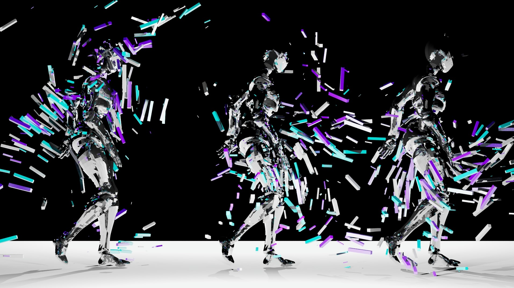

# Nu ink. について
このページは，Nu ink. の概要を簡単にまとめたものです．

## Nu ink. とは何か
- **イノフェス** をプロデュースする学生団体
  - プロデュース：「映画・テレビ番組・イベントなどを企画・制作すること」（岩波国語辞典）
- 2021 年は，[TSUKUBA INNOVATION GALLERY](https://nuink.github.io/TIG_2021/) というサテライトイベントも開催

## イノフェスとは何か
- **イノフェス**
  - 筑波大学と J-WAVE（東京のラジオ局）が共催する，音楽とテクンロジーのフェス「[INNOVATION WORLD FESTA](https://www.j-wave.co.jp/iwf2021/)」の略
  - なぜ筑波大学が関与しているか？
    - 元々筑波大生が発案・企画したものだから
    - 初回（2016 年）は大学会館で開催
  - どんなフェス？
    - **日本最大級** のテクノロジー×音楽のクリエイティヴフェス
      - 公式ページの [LIVE](https://www.j-wave.co.jp/iwf2021/live.html), [TALK](https://www.j-wave.co.jp/iwf2021/talk.html), [TECH.](https://www.j-wave.co.jp/iwf2021/booth.html) の項目を見ると，具体的にどんなことをしていたかがわかる
    - 毎年 9 〜 10 月頃に開催
  - 今年はどんなことした？
    - [新しい学校のリーダーズさんとのライブステージ演出](https://news.j-wave.co.jp/2021/10/post-8576.html)
      - このときは AR の演出に注力していたので，画像だけだとよくわからないかも……
    - [NFTの「今」から考える新たなクリエイションの行方](https://www.j-wave.co.jp/iwf2021/talk.html)
      - 筑波大の NFT 研究者と NFT アーティストの方を交えてトークセッションを行った

## Nu ink. の活動目標
- **お客さんや出演者みんなが，新しい発見や視点を手に入れるために，テクノロジー・音楽を使った，人や学問をつなぐコンテンツを作る**
- どういうこと？
  - 具体的にこれを体現したコンテンツ
    - [知識人と歩く筑波大学](https://nuink.github.io/tsukuba_intellectual/)
      - TSUKUBA INNOVATION GALLERY 2021 で開催
    - [キャラクターと/で暮らす世界―ロボット/アバター/物語](https://www.j-wave.co.jp/iwf2020_archive/talk.html)
      - イノフェス 2020 で実施
  - イノベーションを起こすためには，異なる分野間の交流が必要．そこから新しい知見が生まれてくる．Nu ink. は，異なる分野間が交流できるようなコンテンツを制作したい．
    - cf. 山口栄一『イノベーションはなぜ途絶えたか』（筑摩書房, 2016）

## FAQ
- Q: 会費はありますか？
  - A: 現在は基本的にありません．新歓などで必要になり次第都度集金する可能性はあります．2020年度と2021年度の徴収はありませんでした．
- Q: 活動頻度はどれくらいですか？
  - A: 全体でのミーティングが隔週，個別の企画でのミーティングが（企画によりますが）毎週入ります．曜日は所属メンバーが参加しやすい時間を学期ごとに相談して決めています．時期によっては忙しくなるかもしれません．
- Q: 兼サーはできますか？
  - A: 大丈夫です．仕事は各個人のキャパに応じて割り当てます．
- Q: 自宅通学ですが，活動に支障はありますか？
  - A: 現在はほぼすべての活動をオンラインで行っています．そのため，特に支障はありません．
- Q: どんな仕事ができますか？
  - A: やりたいこと，全部できます．一緒にどうすればできそうか考えましょう．新しく企画を立ち上げることもできます！
- Q: どんな人にぴったりだと思いますか？
  - A: **積極的な人** にはぴったりだと思います！
- Q: 編集技術とか何か特別な技術は必要ですか？
  - A: 特にありません！技術を持っていることに越したことはありませんが、それぞれができることを補っていきましょう！
- Q: ３年生からでも入れますか？
  - A: 過去に３年生編入で入会し、バリバリ活動していた方もいます！学年関係なくご相談ください！
- Q: どの学類の人が所属していますか？
  - A: 例年は情報学群の所属が比較的割合が多い印象ですが、理系、文系、芸術関係なく活動できます！

## 団体に加入することを希望する方へ
- まずは次のいずれかの手段で連絡をください．
  - [Twitter](https://twitter.com/NuinkTSUKUBA) の DM でコンタクトを取る
  - メールを `inofesstudents あっとまーく gmail.com` に送る
- **加入前に面談（15 分前後）を行います．**
  - 面談日程・時間は調整します．
  - まずはご連絡ください！

  [トップページへ戻る](../)
